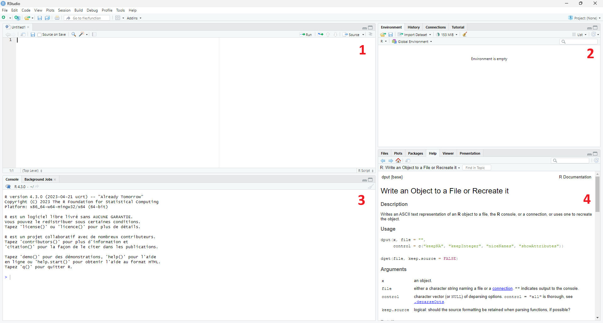

# Installation et environnement R et Rstudio
## Présentation des logiciels
R est un langage de programmation adapté au traitement de données et à l'analyse statistique.

Pour programmer en langage R, il est nécessaire d'installer deux outils essentiels:

1. Le **logiciel R** permet de traduire du texte sous forme de code R en binaire qui est le langage interne du processeur de l'ordinateur. 
1. Le **logiciel RStudio** permet de faciliter l'utilisation du logiciel R en donnant l'accès à une interface utilisateur.

Il est possible de faire une analogie avec une voiture. Le logiciel R est le moteur et RStudio est le tableau de bord. Sans le tableau de bord, il n'est pas possible de controler le moteur.

## Installation

1. Installer R sur le site de R.
    i. Choisir et télécharger la version de R selon votre système d'exploitation.
        * Pour windows : https://cran.r-project.org/bin/windows/base/
        * Pour MAC : https://cran.r-project.org/bin/macosx/
        * Pour Linux : https://cran.r-project.org/index.html
      
    ii. Installer le logiciel R sur votre ordinateur en exécutant le fichier téléchargé.
1. Installer RStudio sur le site suivant: https://posit.co/download/rstudio-desktop/

Après avoir installé ces deux logiciels, vous aurez accès à deux nouvelles applications. Cependant, nous utiliserons uniquement RStudio pour programmer. Lorsque vous exécuterez votre code écrit sur RStudio, ce dernier fera automatiquement appel à R pour exécuter les codes.

## Environnement de travail

Une fois que RStudio est lancé, une interface découpée en plusieurs zones se présente. Ces parties parties peuvent être redimensionnées, masquées ou maximisées selon vos préférences.

```{r echo=FALSE}

```
Chacune des quatre zones a sa propre utilité:

1. Cette zone est dédiée aux fichiers sources. Ce volet permet d'écrire et de sauvegarder les lignes de code. Ce sera la partie la plus utilisée lors de la programmation. Un nouveau script peut être ouvert à partir de l'onglet `File` en haut à gauche de l'écran, puis `New File` et `R Script`. Chaque script peut être enregistré soit via le même onglet en choisissant `Save As`, soit en utilisant les raccourcis classiques de votre clavier. 
1. Cette zone fournit des informations sur les objets, les variables et les données en mémoire sous l'onglet `Environment`.
1. La console est affichée en bas à gauche. Cette partie permet d'entrer et d'exécuter des instructions et voir les résultats s'afficher. 
1. Cette zone permet de naviguer dans le répertoire de travail dans l'onglet `Files`, d'afficher les graphes réalisés dans l'onglet `Plots`, d'afficher les extensions/packages disponibles sous l'onglet `Packages` et également d'afficher l'aide (qui est très complète) sous l'onglet `Help`.
