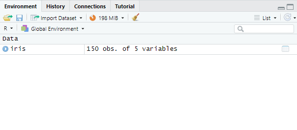
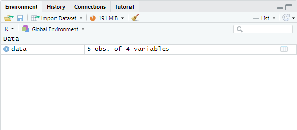

# Packages et données

Ce premier chapitre introduit deux concepts importants dans R. Le premier est les packages et le second concerne les données.

## Installation et gestion des packages

Les packages sont des regroupements de fonctions et de jeux de données développés dans R et qui doivent se télécharger une seule fois, mais ils devront être importés à chaque utilisation. Le code ci-dessous permet d'installer le package ggplot2:

```{r eval=FALSE}

install.packages("ggplot2", dependencies = TRUE)

```

Avant chaque utilisation des packages, il est nécessaire d'importer le package grâce au code suivant:

```{r eval=FALSE}

library(ggplot2)

```

## Téléchargement des données

Dans R, les bases de données se déclinent de plusieurs façons:

1.  Les bases de données peuvent être directement incluses dans R ou dans les packages.
2.  Les bases de données peuvent être créées dans l'environnement sauvées dans l'environnement R. Ces fichiers ont une extension .RData
3.  Les bases de données peuvent être issues de fichiers externes. Ces fichiers peuvent avoir différentes extensions, les plus courantes étant .csv et .txt.

### Bases de données issues de la base de R ou des packages

Le code suivant permet d'importer le jeu de données "iris" disponible de base dans R.

```{r echo=TRUE}
data(iris)
```

Un objet `iris` apparait dans l'environnement du projet comme le montre la figure suivante.

```{r echo=FALSE}

```

Si les données sont dans un package, le package doit être importé au préalable.

### Bases de données issues dans un fichier .RData

Les fichiers `.RData` sont spécifique au language R et peuvent contenir plusieurs objets en un seul fichier. Pour importer des données, il faut utiliser la fonction `load()`

```{r echo=TRUE}
load("04-data.RData")
```

Tous les objets importés sont chargés dans l'environnement de travail.

```{r echo=FALSE}

```

### Bases de données issues de fichiers externes

Les données à analyser sont souvent disponibles dans un fichier externe sous différents formats tels que .csv ou .txt. Pour importer ces données, il existe une fonction par type de fichier (`read.csv()` et `read.table()`). Lorsqu'une de ces fonctions est utilisée, le contenu est stocké dans une dataframe. Il est nécessaire de spécifier le chemin d'accès entre votre logiciel et votre fichier à télécharger. Vous pouvez le faire de deux manières: 1. En utilisant la fonction `setwd()` et en spécifiant à l'intérieur la direction complète qui va permettre au logiciel de retrouver votre document dans vos fichiers. 1. En créant un projet dans lequel vous stockez vos documents. Ces fonctions acceptent des arguments qui permettent de s'adapter à la nature de fichier à importer. Parmi ces arguments, il y en a trois principaux:

1.  `header` qui est une valeur logique (`TRUE` ou `FALSE`) pour la présence d'un en-tête avec les noms de variables. Cet argument est mis par défaut à `TRUE` pour la fonction `read.csv()` et à `FALSE` pour la fonction `read.table()`.
2.  `sep` qui est le caractère dont les champs sont séparés. Cet argument est mis par défaut à `,`.
3.  `dec` qui est le séparateur décimal. Cet argument est mis par défaut à `.`.

Le seul argument obligatoire est le chemin d'accès au fichier à lire. Il n'est pas nécessaire de spécifier le chemin complet si le fichier à lire se trouve dans le dossier du projet. Si ce n'est pas le cas, vous devez spécifier le chemin d'accès complet à partir de ce qui a été fait avec la fonction `setwd()`. Pour charger une base de donnée nommé `04-data.csv` dont les valeurs sont séparées par des virgules, il suffit d'écrire la ligne suivante:

```{r echo=TRUE}
csv_data <- read.csv("04-data.csv")
csv_data
```

Pour charger une base de donnée nommé `04-data.txt` dont les valeurs sont séparées par des points-virgules, il suffit d'écrire comme dans la ligne suivante en n'oubliant pas de sécifier le caractère de séparation avec l'argument `sep=";"`.

```{r echo=TRUE}
txt_data <- read.table("04-data.txt", sep = ";", header = TRUE)
txt_data
```

Il est également possible de charger une base de données issues d'un fichier externe en l'important depuis le menu `File > Import Dataset > From Text` puis de sélectionner le fichier dans vos dossiers.
