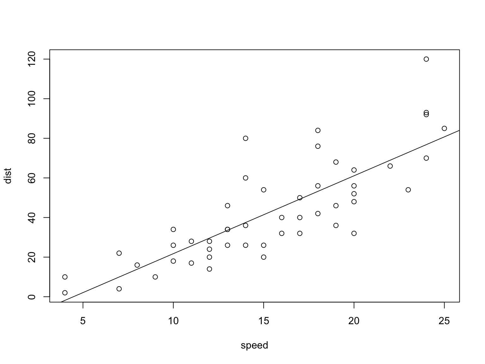
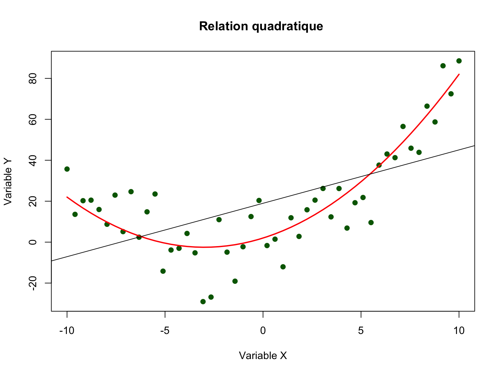
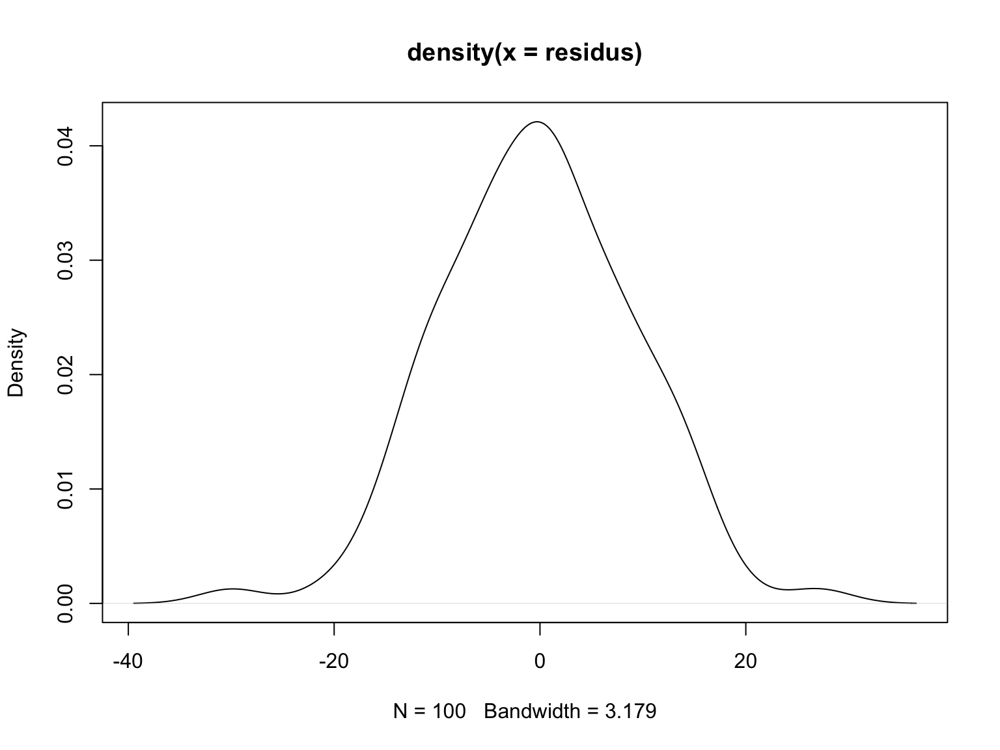
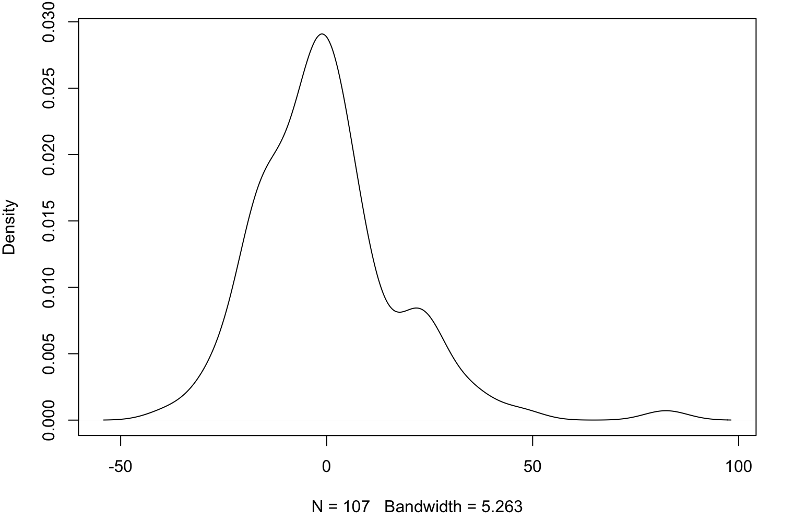
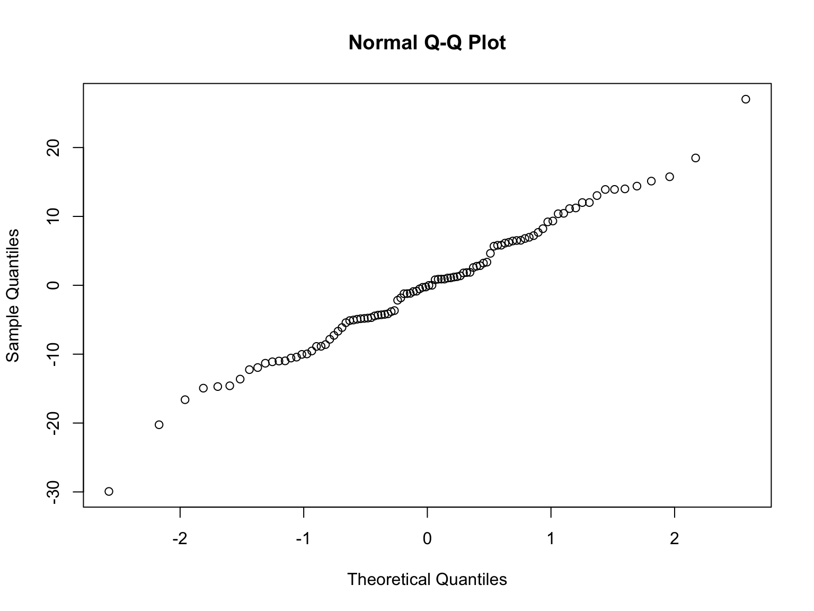
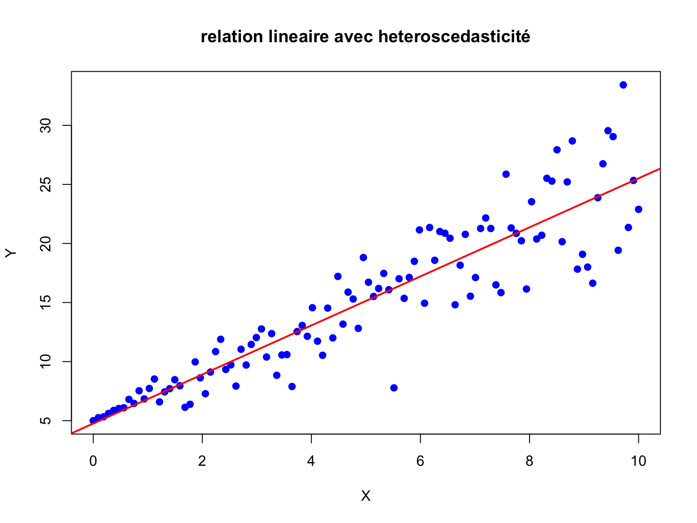
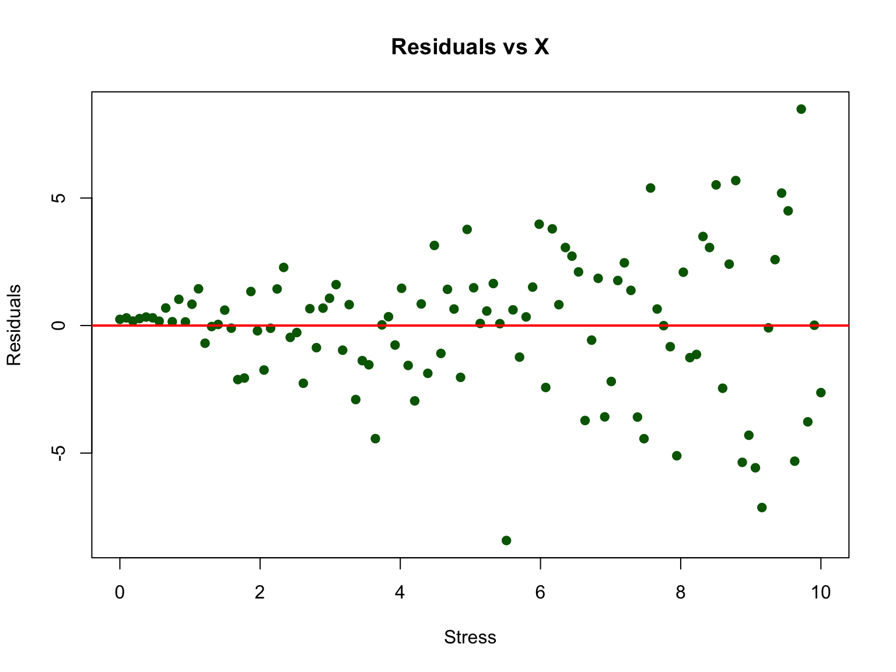
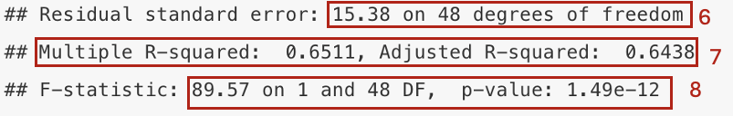

# Régression linéaire simple

Le modèle de régression linéaire simple cherche à déterminer la relation entre **une** variable indépendante (x) et une variable dépendante (y). Plus précisément, ce modèle cherche à déterminer si la variable indépendante (qui peut être qualitative ou quantitative) prédit la variabilité de la variable dépendante (toujours quantitative continue).

Par exemple:

-   Est-ce que le nombre d'heures supp. prédit le stress au travail?

    ```         
    stress ~ heures supp
    ```

-   Est-ce que la taille prédit le poids?

    ```         
    poids ~ taille
    ```

## Visualisation du lien linéaire entre deux variables

Afin de visualiser la nature du lien entre deux variables continues et vérifier si ce lien est linéaire, nous vous proposons de construire un diagramme de dispersion. Cette représentation graphique a deux axes: la variable indépendante sur l'axe des x et la variable dépendante sur l'axe des y.

```{r, echo=TRUE}
# Par exemple, le diagramme de dispersion entre la vitesse d'une voiture (x = speed) et sa distance de freinage (y = dist)
plot(dist ~ speed, data = cars)
```

Les modèles de régression linéaire vont calculer et estimer la meilleure droite qui passe au milieu des données de telle sorte que cette droite représente la relation entre les deux variables. La fonction *lm( )* dans R calcule la pente et l'intercept de cette droite.

```{r echo=TRUE}
m1 <- lm(dist ~ speed, data = cars)
```

Le code suivant permet, une fois le modèle de régression calculé et stocké dans un objet (par exemple m1), de dessiner la droite de régression sur le diagrame de dispersion. Attention, il faut pour cela lancer les deux lignes de code en même temps.

```{r echo=TRUE}
# pour notre exemple :
plot(dist~speed,data=cars)
abline(m1)
```

## Conditions d'application

Avant de pouvoir modéliser nos données par une régression linéaire, quatre conditions d'applications doivent être respectées. Il s'agit de prérequis théoriques et mathématiques:

1.  La relation entre les variables doit être linéaire.

2.  Les données doivent être indépendantes les unes des autres.

3.  Les résidus doivent être distribués normalement, avec une moyenne de 0.

4.  La variance doit être homogène (homoscedasticité). En d'autres mots, l'erreur doit être homogène pour toutes les valeurs de X.

### Relation linéaire

Afin de vérifier le lien linéaire entre deux variables, nous allons utiliser une méthode graphique: la visualisation des données. Comme vu au point 9.1, nous allons utiliser la fonction *plot( ).* Le but ensuite est de juger si le lien entre les données pourrait être correctement estimé par une droite.

**Exemple 1 : Relation linéaire**

```{r echo=FALSE}

```

**Exemple 2 : Relation non-linéaire (quadratique)**

```{r echo=FALSE}

```

### Données indépendantes

Afin de pouvoir modéliser nos données par une régression linéaire, il est important que ces dernières soient indépendantes les unes des autres. Pour vérifier l'application de cette condition, il est important de connaître les conditions de récolte des données, autrement dit, le protocol expérimental.

Par exemple, s'il s'agit de données pairées, vous n'allez pas pouvoir modéliser vos données par une régression linéaire simple.

Dans le cas des exercices que nous vous donnons à faire, vous pouvez, sauf indication contraire, estimer que les données pertinentes sont bel et bien indépendantes.

### Résidus distribués normalement

Les deux dernières conditions d'application concernent les résidus/erreurs de votre modèle de régression linéaire. Ces résidus sont les écarts entre les valeurs observées et les valeurs prédites par votre modèle. En d'autres mots, les résidus représentent l'écart entre les données récoltées et la droite de régression définie par le modèle. Vous pouvez aussi comprendre les résidus comme une représentation du 'bruit' que votre régression n'arrive pas à modéliser.

**Par exemple, la représentation, en rouge, du résidu (ou residual) d'une des observation d'un modèle de régression linéaire.**

```{r echo=FALSE}
knitr::include_graphics("images/residuals.png")
```

Ensuite, afin de pouvoir mesurer et observer les résidus, il faut d'abord définir votre modèle de régression à l'aide de la fonction *lm( )*. Ensuite, afin de connaître les valeurs des résidus, nous vous proposons d'utiliser la fonction *resid( ).*

``` r
modele_1 <- lm(dist ~ speed, data = cars) # définition du modèle de régression linéaire
residus <- resid(modele_1) # calcul des résidus
```

Afin de vérifier la normalité de la distribution des erreurs/résidus, trois options s'offrent à vous.

1.  Vous pouvez visualiser la distribution des résidus par un graphique de densité. **Critère de décision**: est-ce que cette distribution ressemble à une distribution normale centrée en 0?

``` r
# exemple de résidus distribués normalement
plot(density(residus))
```

```{r echo=FALSE}

```

``` r
# exemple de résidus qui ne sont pas tout à fait distribués normalement
plot(density(residus2))
```

```{r echo=FALSE}

```

2.  Vous pouvez également visualiser la normalité de la distribution des résidus par un QQplot. Un QQplot représente les résidus (sur l'axe des y) en fonction des valeurs théoriques des résidus si la distribution était parfaitement normale. **Critère de décision**: Est-ce que les points sont sur la diagonale.

``` r
# mêmes exemples que ci-dessus, résidus distribués normalement
qqnorm(residus)
```

```{r echo=FALSE}

```

3.  Finalement, de manière intuitive, le diagramme de dispersion avec la droite de régression vous permet également d'avoir une idée de le distribution des résidus. La condition de normalité est respectée si il y a autant de résidus en haut et en bas de la droite, et que les résidus ne sont pas plus éloignés de la droite en haut qu'en bas (ou vice-versa)

### Homoscedasticité

Finalement, il est essentiel que les résidus se distribuent de manière homogène pour toutes les valeurs de x. En d'autres termes, que la précision de la droite de régression reste la même pour toutes les valeurs de x. Afin de vérifier cette condition, vous allez visualer les données autour de la droite de régression et faire un graphique des résidus en fonction de votre variable indépendante (x). **Critère de décision:** est-ce que les résidus pourraient être contenus dans un rectangle (homoscédasticité) ou non (hétéroscédasticité).

**Exemple 1 : Relation linéaire avec hétéroscedasticité (variance hétérogène)**

```{r echo=FALSE}

```

``` r
plot(Stress, residuals) # graphique des résidus en fonction de x
abline(h = 0, col = "red", lwd = 2)
```

```{r echo=FALSE}

```

**Exemple 2 : Comparaison entre homoscédasticité et hétéroscédasticité**

```{r echo=FALSE}
knitr::include_graphics("images/homo_hetero.png")
```

A nouveau, simplement regarder le diagramme de dispersion et la droite de régression vous permet également d'avoir une idée de si cette conditoin est respectée. Si elle l'est, les résidus sont similaires tout au long de la droite de régression.

## Paramètres et tests d'hypothèses

Si toutes les conditions d'application sont respectées, vous allez pouvoir interprêter les résultats de votre modèle de régression linéaire simple.

En guise de rappel, pour spécifier votre modèle de régression vous allez utiliser la fonction *lm( )*. Ensuite, pour en observer les paramètres/résultats, vous allez utiliser la fonction *summary( )*.

``` r
modele_1 <- lm(dist ~ speed, data = cars)
summary(modele_1)
```

```{r echo=FALSE}
knitr::include_graphics("images/parametres.png")
```

En quelques mots, voici ce que représentent les différents indices et paramètres de votre sortie. Vous avez deux blocs principaux, un premier qui vous informe sur les paramètres du modèle (2:5), un second qui vous informe sur la validité du modèle (6:8).

**Bloc 1 - Les paramètres de votre modèle**

1.  Le rappel de votre équation de régression linéaire
2.  Les valeurs de paramètres de votre modèle. Vous avez une valeur pour l'ordonnée à l'origine (intercept) ainsi que pour la variable indépendante (ou prédicteur)
3.  L'erreur standard de chacun des paramètres
4.  Un score t est calculé pour chaque paramètre afin d'en tester la significativité
5.  La p-valeur de chaque paramètre. Cette p-valeur vous permet de juger de la significativité de vos différents paramètres

```{r echo=FALSE}
knitr::include_graphics("images/2.png")
```

**Bloc 2 - La validité de votre modèle**

6.  L'erreur standard des résidus du modèle

7.  Les coefficients de détermination de votre modèle (R-carré et R-carré ajusté). Ces derniers vous indiquent la part de variance de votre variable dépendante qui est expliquée par votre modèle.

8.  Cette F-statistic et sa probabilité critique vous permettent de conclure sur la significativité de votre modèle. Est-ce que ce dernier 'prédit' significativement votre variable dépendante? Plus concrètement, ces valeurs permettent de rejeter ou non l'hypothèse nulle suivante: le modèle avec la variable indépendante et un modèle avec uniquement un intercept ne diffèrent pas quant à leur capacité à expliquer la variabilité de la variable dépendante.

```{r echo=FALSE}

```

## Standardiser une variable

Souvent, afin de faciliter l'interprétation et la comparaison des paramètres, nous allons standardiser nos variables avant de les insérer dans notre modèle de régression linéaire.

Le processus de standardiser une variable équivaut à:

-   centrer la variable - soustraire la moyenne de la variable à chaque score individuel

-   réduire la variable - diviser chaque score par l'écart-type de la variable

En d'autre mot, standardiser une variable est le même procédé qu'en calculer le score z.

``` r
speed_z <- (speed - mean(speed)) / sd(speed) #vitesse standardisée
dist_z <- (dist - mean(dist)) / sd(dist) #distance de freinage standardisée
modele_z <- lm(dist_z ~ speed_z) #modèle sur variable standardisées
summary(modele_z)
```

```{r echo=FALSE}
speed_z <- (cars$speed-mean(cars$speed))/sd(cars$speed)
dist_z <- (cars$dist - mean(cars$dist))/sd(cars$dist)
modele_z <- lm(dist_z ~ speed_z)
summary(modele_z)
```
